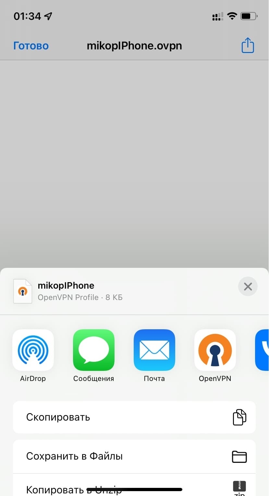
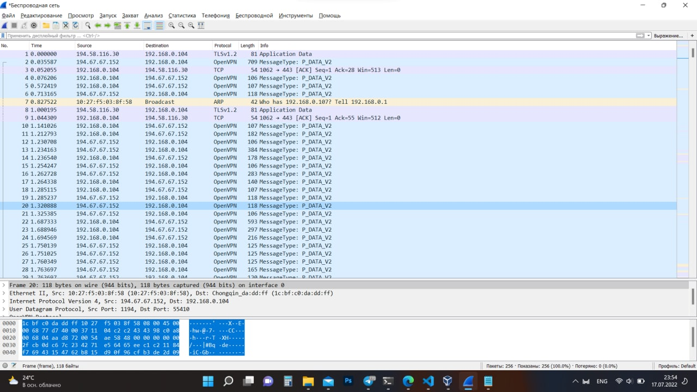

# OpenVPN-installer

Элементарное поднятие OpenVPN сервера на Ubuntu 20.04.
Все команды были взяты с сайта <a href="https://www.digitalocean.com/community/tutorials/how-to-set-up-and-configure-an-openvpn-server-on-ubuntu-20-04-ru">Digitalocean</a>,
но в отличие от оригинала - я не использовал дополнительный сервер для создания ЦС (центра сертификации)


## Установка

Скачайте код

```
git clone https://github.com/mikop63/OpenVPN-installer.git
cd OpenVPN-installer/
```

Для запуска процесса установки введите команду. Скрипт необходимо запускать от имени пользователя состоящего в группе sudo. Чтобы добавить пользователя ``` mikop ```
(или любого другого) эту группу необходимо выполнить команду ``` usermod -a -G sudo mikop ```

```
bash OpenVPN.sh
```

После начала выполнения скрипт уточнит ваши намерения на что достаточно нажать кнопку ``` Enter ``` и он начнет процесс установки с обновления пакетов.

Если у вас нет сил/желания/времени/скорости на эту процедуру, в файле ``` OpenVPN.sh ``` закомментируйте 17 строку поставив вначале ``` # ```. 
Но в таком случае в процессе установки могут возникнуть ошибки.

Процесс установки автоматизирован. Все что от вас требуется - 7 раз нажать кнопку ENTER и иногда вписывать **yes**.

1. [sudo] password for mikop: **Пароль от пользователя**
2. опционально для apt-get update у всех по-разному.
3. Common Name (eg: your user, host, or server name) [server]: **ENTER** (клавиша на клавиатуре)
4. Confirm request details: **yes** (набирается на клавиатуре)
5. Common Name (eg: your user, host, or server name) [client1]: **ENTER** (клавиша на клавиатуре)
6. Confirm request details: **yes** (набирается на клавиатуре)
7. Proceed with operation (y|n)? **y**

После всех проделанных операций автоматически выполнится команда ``` reboot ```. После перезагрузки пере подключитесь к серверу. 

Если все прошло хорошо, то в папке ``` ~/client-configs ``` появится файл ``` client2.ovpn ```. Это файл конфигурации, через который в будущем и будет 
выполняться подключение к серверу.

## Клиент

Инструкции для всех живых систем (Windows, Linux, MacOS, iOS, Android) описаны на 
<a href="https://www.digitalocean.com/community/tutorials/how-to-set-up-and-configure-an-openvpn-server-on-ubuntu-20-04-ru#13">Digitalocean шаг 13 — Установка клиентской конфигурации</a>.
Для некоторых ОС я расскажу

### Windows

Скачиваем и устанавливаем официальное приложение <a href="https://openvpn.net/client-connect-vpn-for-windows/">OpenVPN connect</a>. 

Затем необходимо получить файл конфигурации ``` ~/client-configs/client2.ovpn ``` любым удобным для вас способом. Я скачивал через ssh:

```
scp mikop@194.67.67.152:~/client-configs/client2.ovpn "D:\OpenVPN\"
```
mikop - моя учетная запись

194.67.67.152 - IP машины, с которой я скачиваю файл

После ввода пароля файл скачается в папку ``` D:\OpenVPN\ ``` или любую другую, смотря какую вы укажите. Двойным щелчком мыши мы открываем его через программу
OpenVPN connect и подключаемся к нашей VPN сети

### Linux

В терминале вводим команду

```
sudo apt install openvpn
```

С сервера выкачиваем конфигурационный файл
```
scp mikop@194.67.67.152:~/client-configs/client2.ovpn ~
```

Для правильной работы DNS необходимо раскомментировать несколько строк, подробнее читайте
<a href="https://www.digitalocean.com/community/tutorials/how-to-set-up-and-configure-an-openvpn-server-on-ubuntu-20-04-ru#13">здесь</a>.

Но и без DNS все будет работать, запускам наш конфиг командой:
```
sudo openvpn --config client2.ovpn
```

### iOS

Скачиваем в AppStore приложение <a href="https://apps.apple.com/ru/app/openvpn-connect/id590379981">OpenVPN connect</a>.

Отправляем config в любом удобном мессенджере сами себе. Можно и кому-то но через один конфиг может одновременно сидеть только один пользователь. 
Например в телеграмме. Если попытаться открыть документ iOS предложит в вариантах приложение OpenVPN connect. 

<p align="center">

</p>

## Создание дополнительных конфигураций

Через один конфигурационный файл к VPN может быть подключен только один пользователь. Поэтому если вы хотите использовать VPN и компьютере, и на телефоне, и на планшете 
одновременно, необходимо под каждое устройство создать свой конфигурационный файл. 

Запускаем скрипт ответственный за создание пользователей
```
cd OpenVPN-installer/
bash OVPNclient.sh
```
Минимум действий.

1. Скрипт попросит ввести имя пользователя. По умолчанию ```mikop```. Или вводите свое и нажимаете **ENTER** (клавиша на клавиатуре)
2. Common Name (eg: your user, host, or server name) [client1]: **ENTER** (клавиша на клавиатуре)
3. [sudo] password for mikop: **Пароль от пользователя**
4. Confirm request details: **yes** (набирается на клавиатуре)

Теперь в папке ```~/``` появился конфигурационный файл с названием, который вы ввели в пункте 1. Можете отправить его на устройство. 

## Проверка

### Вариант 1

Если у вас в локальной сети диапазон IP 192.168.0.0, тогда выполните команду без VPN и с VPN.   
```
ping 10.8.0.1
```
Без VPN возникнет ошибка. А с VPN пакеты пройдут нормально

### Вариант 2

Откройте сайт https://www.dnsleaktest.com/ без VPN и в отдельной вкладке с VPN. Ваш IP должен поменяться. 

А при нажатии кнопки Extended test, можно проверить DNS сервер. По умолчанию VPN настроен на OpenDNS (можно поменять в конфигурации).

Аналоги:
https://whatismyipaddress.com/
https://ipleak.net/

### Вариант 3

Проверить траффик через Wireshark. Необходимо открыть любой сайт и записать трафик. Например, сайт http://kremlin.ru/

<p align="center">

</p>

## Видео инструкция


[](https://www.youtube.com/watch?v=rDbjBE986I4)


